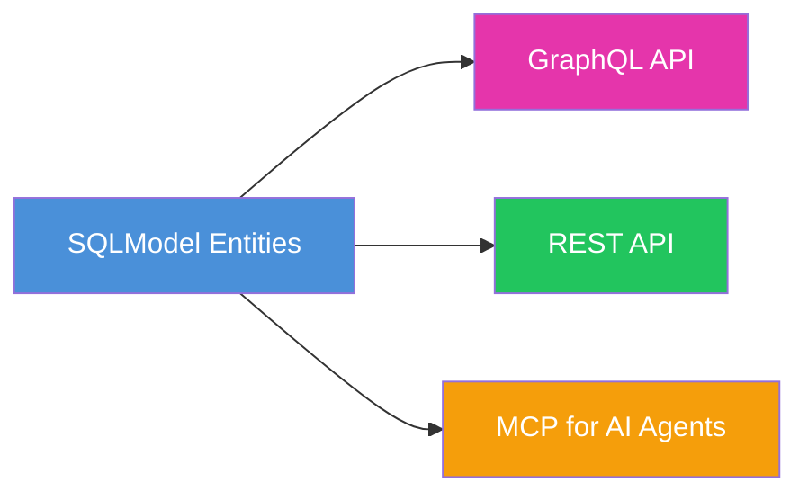

# sqlmodel-nexus

**Define your SQLModel entities once. Get GraphQL, REST, and MCP APIs — with N+1 protection built in.**



---

## Pick Your Path

| | GraphQL | REST (Core API) | MCP / UseCase |
|---|---------|-----------------|---------------|
| **What you get** | Auto-generated SDL + DataLoader-executed GraphQL endpoint | Pure Pydantic DTOs assembled via Resolver tree traversal | Four-layer progressive MCP tools for AI agents |
| **Key API** | `@query` / `@mutation` + `GraphQLHandler` | `DefineSubset` + `ErManager` + `Resolver` | `UseCaseService` + `create_use_case_mcp_server` |
| **Best for** | Frontend apps needing flexible queries | REST APIs, service-layer DTOs | AI agent integration (Claude, Cursor, etc.) |
| **Demo** | [`demo/app.py`](https://github.com/allmonday/sqlmodel-nexus/blob/master/demo/app.py) | [`demo/core_api/`](https://github.com/allmonday/sqlmodel-nexus/blob/master/demo/core_api/) | [`demo/use_case/`](https://github.com/allmonday/sqlmodel-nexus/blob/master/demo/use_case/) |
| **Quick Start** | ↓ [GraphQL Quick Start](#graphql-path) | ↓ [Core API Quick Start](#core-api-path) | ↓ [UseCase Quick Start](#usecase-path) |

---

<a id="graphql-path"></a>

## 🟣 Path 1: GraphQL API

Mark entity methods with `@query` / `@mutation`, get a full GraphQL schema + DataLoader:

```python
from sqlmodel import SQLModel, Field, Relationship, select
from sqlmodel_nexus import query, mutation, GraphQLHandler

class User(SQLModel, table=True):
    id: int | None = Field(default=None, primary_key=True)
    name: str
    posts: list["Post"] = Relationship(back_populates="author")

    @query
    async def get_users(cls, limit: int = 10) -> list["User"]:
        async with get_session() as session:
            return (await session.exec(select(cls).limit(limit))).all()

handler = GraphQLHandler(base=SQLModel, session_factory=async_session)
# handler.execute("{ userGetAll(limit: 5) { id name posts { title } } }")
```

📖 Full guide: [GraphQL Mode](./guide/graphql_mode.md) · [Pagination](./guide/graphql_pagination.md) · [Auto Query](./guide/graphql_auto_query.md)

---

<a id="core-api-path"></a>

## 🟢 Path 2: REST API (Core API)

Define `DefineSubset` DTOs — relationship fields auto-load via DataLoader. No SQL injection, no N+1:

```python
from sqlmodel_nexus import DefineSubset, ErManager

class UserDTO(DefineSubset):
    __subset__ = (User, ("id", "name"))

class TaskDTO(DefineSubset):
    __subset__ = (Task, ("id", "title", "owner_id"))
    owner: UserDTO | None = None                    # Auto-loaded!

er = ErManager(base=SQLModel, session_factory=async_session)
Resolver = er.create_resolver()
result = await Resolver().resolve(dtos)             # Tree traversal resolves all relationships
```

📖 Full guide: [Core API Mode](./guide/core_api.md) · [Advanced](./guide/core_api_advanced.md) · [Custom Relationships](./guide/custom_relationship.md)

---

<a id="usecase-path"></a>

## 🟡 Path 3: MCP for AI Agents (UseCase)

Write business logic once in `UseCaseService` — serve both MCP and FastAPI from the same class:

```python
from sqlmodel_nexus import UseCaseService, UseCaseAppConfig, create_use_case_mcp_server

class SprintService(UseCaseService):
    @query
    async def list_sprints(cls) -> list[SprintSummary]:
        dtos = [SprintSummary(**dict(row._mapping)) for row in rows]
        return await Resolver().resolve(dtos)

mcp = create_use_case_mcp_server(apps=[
    UseCaseAppConfig(name="project", services=[SprintService], ...),
])
mcp.run()  # Exposes 4-layer MCP tools: list_apps → list_services → describe_service → call
```

📖 Full guide: [UseCase Service](./advanced/use_case_service.md) · [FastAPI](./advanced/use_case_fastapi.md) · [Voyager](./advanced/voyager.md) · [MCP Service](./advanced/mcp_service.md)

---

## Complete Tutorial

For a step-by-step walkthrough with the same Sprint/Task model used across all demos, see [`demo/core_api/`](https://github.com/allmonday/sqlmodel-nexus/blob/master/demo/core_api/). The DTOs progress through 5 levels of complexity:

| Level | What | File |
|-------|------|------|
| 1 | Basic field selection + FK hiding | [`dtos.py` → `UserSummary`](https://github.com/allmonday/sqlmodel-nexus/blob/master/demo/core_api/dtos.py#L21) |
| 2 | Implicit relationship auto-loading | [`dtos.py` → `TaskSummary`](https://github.com/allmonday/sqlmodel-nexus/blob/master/demo/core_api/dtos.py#L30) |
| 3 | `post_*` derived field computation | [`dtos.py` → `SprintSummary`](https://github.com/allmonday/sqlmodel-nexus/blob/master/demo/core_api/dtos.py#L53) |
| 4 | Cross-layer data flow (`ExposeAs` / `SendTo` / `Collector`) | [`dtos.py` → `SprintDetail`](https://github.com/allmonday/sqlmodel-nexus/blob/master/demo/core_api/dtos.py#L107) |
| 5 | Custom non-ORM relationships | [`dtos.py` → `TaskWithTags`](https://github.com/allmonday/sqlmodel-nexus/blob/master/demo/core_api/dtos.py#L140) |

---

## API Reference

| Module | Key exports |
|--------|-------------|
| [GraphQLHandler](./api/api_graphql_handler.md) | `GraphQLHandler`, `SDLGenerator`, `AutoQueryConfig` |
| [Core API](./api/api_core.md) | `ErManager`, `Resolver`, `DefineSubset`, `SubsetConfig`, `Loader` |
| [Cross-layer Data Flow](./api/api_cross_layer.md) | `ExposeAs`, `SendTo`, `Collector` |
| [Relationships & ER Diagram](./api/api_relationship.md) | `Relationship`, `ErDiagram` |
| [MCP API](./api/api_mcp.md) | `config_simple_mcp_server`, `create_mcp_server` |
| [UseCase API](./api/api_use_case.md) | `UseCaseService`, `UseCaseAppConfig`, `create_use_case_mcp_server`, `create_use_case_router` |
